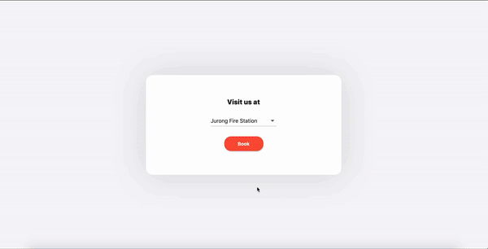
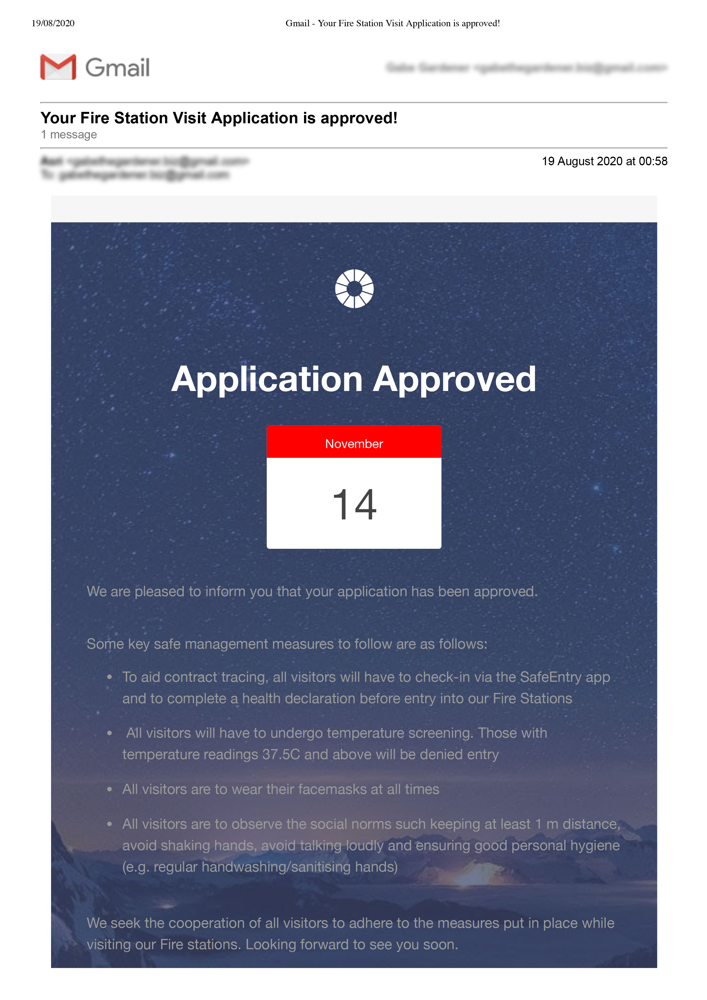
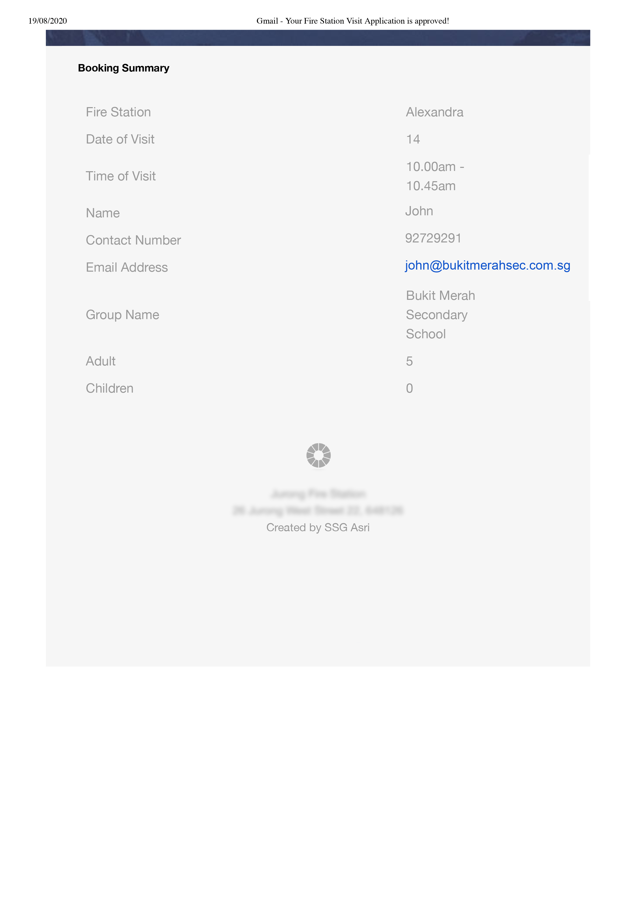
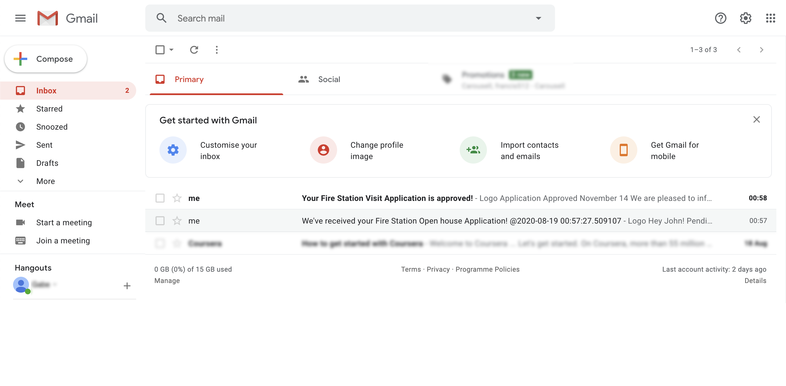

# Fire-Station-Open-House-Booking
Conceptualised 2 separate MVP ideas to handle Fire Station Visit Bookings using a Mobile Application and a Web app

# Project description

## What's the problem?
Currently during the COVID period, people who wants to visit a Fire Station will have to book via a Google Form like platform. There are 2 session in each day and 5 pax per session for Fire Station Visit. Users will wait for the admin to approval which creates an extra workload burden for the admin personnel to reject every single application once the booking for that day is full.

## The Idea

**Proposal 1**:
**-Utilising Google Form, Cloud Database and a mobile App**
> What this solution offer is to ease the menial job of sending rejection emails.
Google Form will collect the information filled by the user and store it into a Cloud Database via AppScript. The admin personnel will then have an overview of all the applications made and it is filterable by stations via the mobile app. The app will also automatically reject when it is >5 pax or when the session is already booked. Once all the sessions are booked, for any following application made, the user will receive a rejection email.

**Proposal 2:
-Utilising a WebApp with Cloud Database**
> Users can immediately glance through the dates availability at the first glance. Users will also receive an email stating their booking summary right after their booking. This would eliminate the need for a middle man to manually approve requests.

**Proposal 1 Showcase(Mobile App):

**Proposal 2 Showcase(WebApp):

**Email Template**
 |  
